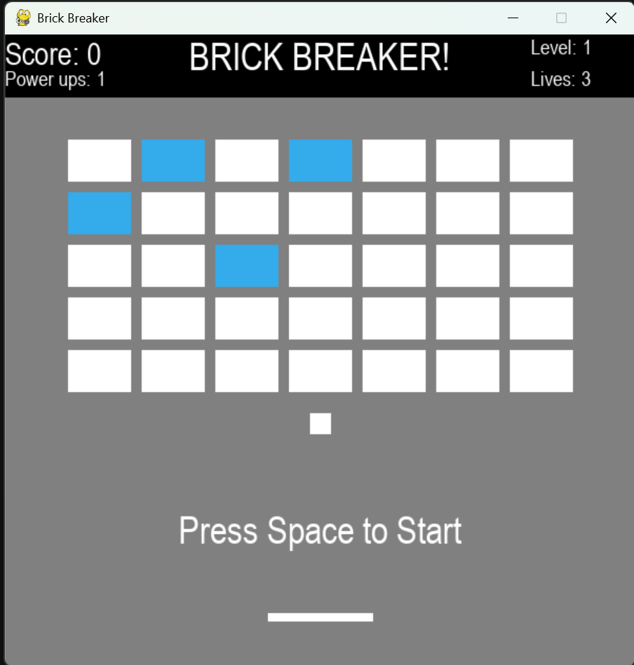

# Brick-Breaker

## Overview
The program is meant to recreate the famous computer game "Brick Breaker" using Pygame. The game is for one player where they control a paddle to hit the ball to prevent it from falling to the bottom of the screen. The ball bounces around to destroy all the bricks to clear the level and score points. 

## Extra Feature 1: Bricks creating balls
One extra feature added into the game is the ability for bricks to create balls. When a ball hits a blue brick, another ball will spawn and bounce around to destroy other bricks. This feature makes the game more fun and interesting as the user can have more balls to hit. At the same time, creating more balls allows the game to continue longer because it will take more time for the player to let all the balls fall to the bottom of the screen to lose a life. Additionally, when a user clears a level with more than one ball, all the balls they have will also move onto the next level. 

## Extra Feature 2: Power ups
Power ups has been added into the game. There are two different power ups:
* When the user clicks the "w" key, all the balls are slowed down. This gives the player the time to hit the ball before it falls onto the bottom of the screen. The ball will return to its normal speed after bouncing off the paddle or colliding with a brick. 
* Another power up is that when the user clicks the "s" key, the length of the paddle increases. It gives the player the advantage to reach and hit more balls at once. This power up only lasts for eight seconds before the paddle returns to its original length.

These power ups can be used once per level and only one power up can be used. It prevents the game from being two easy for the player. However, if the player loses a life in the middle of a level and they already used a power up, they can use power ups again. 

## Other features
Some other features include:
* No limit on levels. The game will go on until the user lose all their lives.
* Lives. The user has three lives each round. They lose a life when all the balls fall to the bottom of the screen and the ball will respawn in the middle again.
* Game restarting. When the user lose all their lives, the game is over. They are given the option to press the space bar if they want to play again or they can simply close the window to exit. This makes it more convenient for the user as they do not have to stop the program and run it again to restart the game.
* The score, level, lives, and power ups that can be used is kept track of throughout the game.

## Rules
* Press "a" to move the paddle to the left and "d" to move the paddle to the right. 
* Don't let the ball fall to the bottom of the screen by using the paddle to hit it. 
* Score points by destroying bricks with the ball. 
* The game will end when you lose three lives. You lose a life each time when you run out of balls (all the balls fall to the bottom of the screen).
* A ball hitting a blue brick will cause another ball to spawn out of it.
* You can press the "w" key once each level to use the power up. It slows down all the balls but returns back to the normal speed when the paddle hits it. Alternatively, you can also press the "s" key to make the paddle longer for eight seconds.
* Only one power up can be used each level but you can use power ups again if you lose a life.
* Destroying brick will increase the score by one.

## Running the Program
Ensure that Python and Pygame is installed. Run ```main.py``` and the game window will pop up. If you want to end the game, press the red "X" on the top right corner of the window to close it.

## Screenshots


